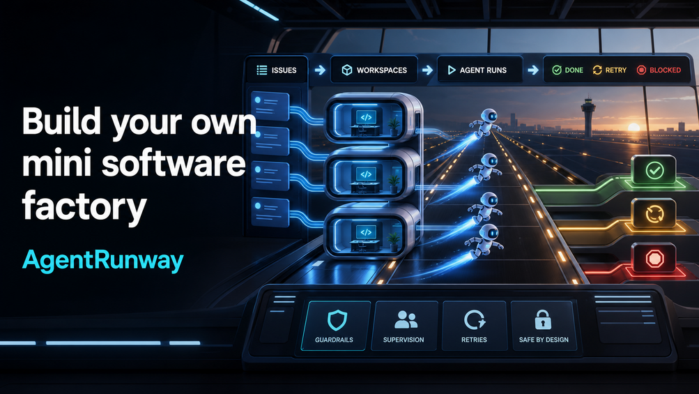

# AgentRunway



AgentRunway is a failure-driven Elixir/OTP learning project for understanding
Symphony-style AI agent orchestration.

The project starts as a pure job queue and grows into a tiny orchestrator with
supervised workers, retry policy, fake Linear polling, fake Codex runs, and
per-issue workspaces.

## Why Symphony

[Symphony](https://github.com/openai/symphony) is the orchestration machinery
for Codex-style AI agents. It automates the layer that turns issues into
controlled agent runs, so a team can choose between a highly efficient Software
Factory with human guardrails or a more autonomous, lights-out Dark Factory.

AgentRunway is a mini-Symphony for learning. It keeps the same architectural
shape - tracker polling, authoritative orchestrator state, supervised workers,
retry/backoff, blocked work, workspace boundaries, and agent-run lifecycle -
but replaces production integrations with small fake modules you can inspect,
break, and understand.

## Install Elixir

This workspace does not currently have `elixir`, `erl`, or `mix` installed.
Install Elixir from the official guide first:

<https://elixir-lang.org/install.html>

After installation:

```bash
mix test
iex -S mix
```

## Self-Guided Course

Start with the self-guided AgentRunway course:

- [course/README.md](course/README.md)

The course is the recommended path if you want a practical, hands-on tutorial.
It includes full walkthroughs, labs, break-it exercises, solutions, reflection
questions, and checkpoints. It is organized around the same failure-driven
progression as the code:

1. pure queue
2. queue as a `GenServer`
3. external workers and failures
4. supervision and bounded concurrency
5. orchestrator state
6. workspace and adapter boundaries
7. Symphony architecture mapping

## Quick Code Reading Order

If you want to inspect the implementation directly, use this shorter path:

1. Read `lib/agent_queue/queue.ex` and `test/agent_queue/queue_test.exs`.
2. Read `lib/agent_queue/queue_server.ex` and `test/agent_queue/queue_server_test.exs`.
3. Read `lib/agent_queue/agent_runner.ex`.
4. Read `lib/agent_queue/orchestrator.ex` and `test/agent_queue/orchestrator_test.exs`.
5. Read `docs/failure_map.md`.
6. Compare the shape to Symphony's spec:
   <https://github.com/openai/symphony/blob/main/SPEC.md>

## Manual Session

Once Elixir is installed:

```elixir
{:ok, tracker} =
  AgentQueue.FakeTracker.start_link(
    issues: [
      %AgentQueue.Issue{
        id: "AGENT-1",
        identifier: "AGENT-1",
        title: "Try a fake Codex run",
        description: "This is a synthetic issue.",
        state: "Ready",
        metadata: %{runner: :success}
      }
    ]
  )

{:ok, orchestrator} =
  AgentQueue.Orchestrator.start_link(
    tracker_ref: tracker,
    max_concurrent: 1,
    retry_backoff_ms: 100
  )

AgentQueue.Orchestrator.poll(orchestrator)
AgentQueue.Orchestrator.stats(orchestrator)
AgentQueue.Orchestrator.snapshot(orchestrator)
```

Try changing `metadata` to `%{runner: :fail}`, `%{runner: :crash}`, or
`%{runner: :block}` and observe how the orchestrator state changes.

## Project Shape

- `AgentQueue.Queue`: pure data state machine.
- `AgentQueue.QueueServer`: the queue becomes one actor that owns state.
- `AgentQueue.AgentRunner`: fake Codex runner boundary.
- `AgentQueue.FakeTracker`: fake Linear tracker boundary.
- `AgentQueue.WorkspaceManager`: one workspace per issue.
- `AgentQueue.Orchestrator`: Symphony-shaped runtime owner.

The project intentionally favors clarity over production completeness. Durable
storage, real Linear API calls, real Codex App Server integration, dashboards,
and distributed execution are the next steps after the OTP shape is clear.
